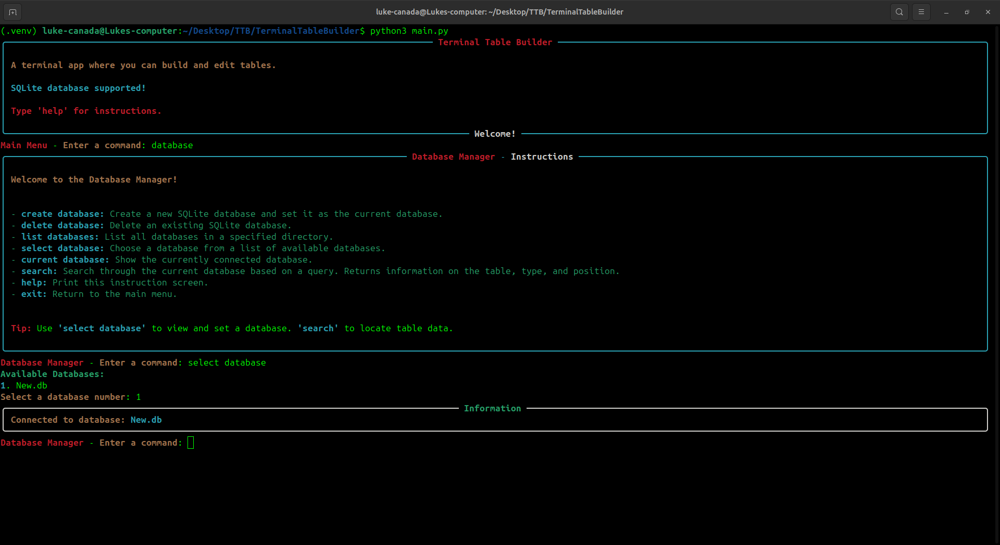
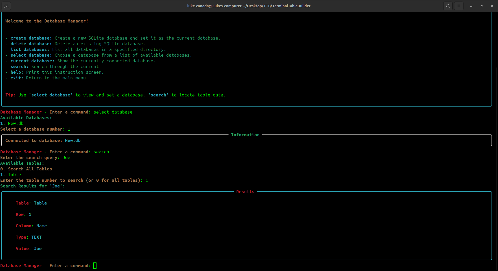
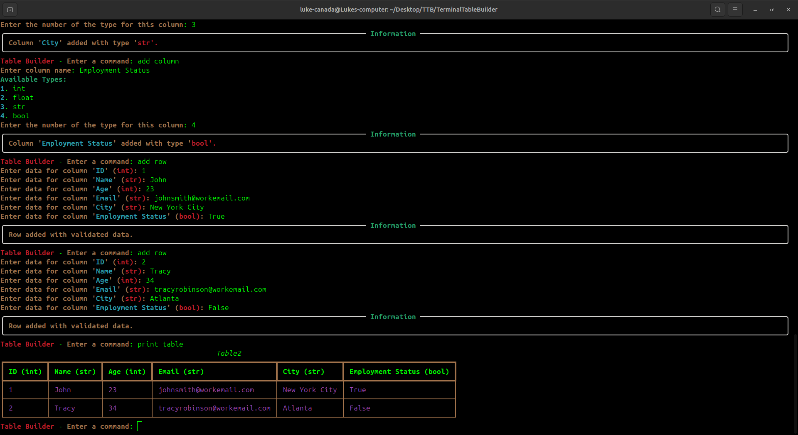

# 💾 Terminal Table Builder 💾

A terminal-based application that allows you to easily build and edit tabular data.

Easily view and edit tables in databases from the terminal.

## Connecting To A Database

## Searching Data

## Adding Data To A Table

## Prerequisites

- Python 3.9+

## Setup

1. **Clone the repository:** `git clone https://github.com/canadaluke888/TerminalTableBuilder.git`
2. **Set up virtual environment:** For Linux and Mac OS, `python3 -m venv .venv`. For Windows, `python -m venv .venv`
3. **Activate virtual environment:** For Linux and Mac OS, `source .venv/bin/activate`. For Windows, `.venv/Scripts/Activate`
4. **Install requirements:** `pip install -r requirements.txt`

## Usage

- **Starting the application:** For Linux and Max OS, `python3 main.py`. For Windows, `python main.py`.

### Database

- **Creating a new database:** In the main menu, enter the `database` command. Enter the `create database` command and then name the new database. Your database will automatically be selected as the working database.
- **Deleting a database:** Enter the `delete database` command and then select the database that you want to delete from the list.
- **Selecting an existing database:** Enter the `select database` command and then choose from the list of available databases.
- **Viewing the list of available databases:** Enter the `list databases` command.
- **Closing an active database:** Enter the `close database` command.
- **Viewing the current database:** Enter the `current database` command.
- **Searching the database:** Enter the `search` command and then enter a search query. It will return information on the location if a match is found.

### Table Builder

- **Building a new table:** In the main menu, enter the `table builder` command. Enter a name for the table. From here you can add data to the table.
- **Adding a column:** Enter the `add column` command. Enter the name for the column. Specify the data type for the column.
- **Changing the data type for a column:** Enter the `change type` command. Enter the number corresponding to the column that you want to change the data type for. select the number corresponding to the new data type you want.
- **Changing the name for a column:** Enter the `rename column` command. Enter the number corresponding to the column name that you want to change. Enter the new name for the column.
- **Adding a row:** Enter the `add row` command and the program will walk through each heading allowing you to enter data for each cell. Be sure to enter the correct data type that you specified for the column.
- **Removing a column:** Enter the `remove column` command. Enter the column name.
- **Removing a row:** Enter the `remove row` command. Enter the row index.
- **Editing a cell:** Enter the `edit cell` command. Enter the index for the cell that is displayed on the screen. For example, if you wanted to edit the second row of the second column, you would enter '2,2'. After entering the index for the cell, you can then enter the new information that you want in the cell.
- **Printing the table:** Enter the `print table` command.
- **Showing the current working table:** Enter the `current table` command and the current working table will be printed to the screen.
- **Loading data from a CSV file:** Enter the `load csv` command. Enter the path to the CSV file.
- **Loading more than one CSV file:** Enter the `load csv batch` command. Enter the path to the directory that contains the CSV files. Specify if you want to add the CSV files in the subdirectories. All tables loaded will be saved under the default name "Table".
- **Saving data to a CSV file:** Enter the `save csv` command. You will be prompted on if you want to use the name of the table as the name of the CSV file. The CSV file will appear in the root directory of the app.
- **Saving a table to a PDF file:** Enter the `save pdf` command. You will be prompted on if you want to use the table name as the file name. The PDF file will appear in the root directory of the application.
- **Saving the table data to a JSON file:** Enter the `save json` command. Specify if you want to use the name of the table as the name for the JSON file. The file will appear in the root directory for the application.
- **Loading a table from the database:** Enter the `load table` command and then select from the list of available tables. Make sure that you have a database selected first.
- **Saving a table to a database:** Enter the `save table` command. The table should be saved to the currently selected database.
- **Updating an existing table in the database:** After making your changes, enter the `save table` command. When prompted to overwrite the existing database, enter 'y'.
- **Deleting a table from the database:** Enter the `delete table` command. Select the number corresponding to the table you want to delete.
- **Viewing the available tables in the database:** Enter the `list tables` command.
- **Clearing the table:** Enter the `clear table` command.
- **Renaming the table:** Enter the `rename` command. Enter the new name for the table.
- **Viewing the JSON data for the table:** Enter the `print table data` command.
- **Exiting the app:** You can you use the `exit` command to exit the application and navigate through the different parts of the app. You must be in main menu to close app.

### Settings

- **Turning on Auto Print:** Once in the settings, you can enter the `autoprint_table` command. You will then be prompted if you want to turn Auto Print on or off. Turning on autoprint_table will automatically print the table after a change has been made.
- **Turning on Hide Instructions:** In the settings, you can enter the `hide_instructions` command. You will then be prompted if you want to turn Hide Instructions on or off. Turning on hide_instructions will stop automatically printing the instructions to the screen while navigating different parts of the app.
- **Turning on Auto Update:** In the settings, enter the `auto_update` command. You will then be prompted if you want to turn Auto Update on or off. Turning on auto_update will automatically save changes to an existing table in the database.  

## Third-Party Dependencies

- [rich](https://github.com/Textualize/rich) - MIT LICENSE

- [report lab](https://pypi.org/project/reportlab) - BSD LICENSE
